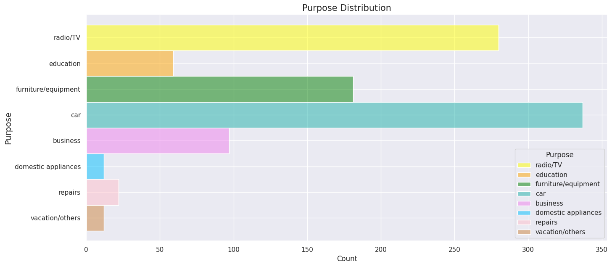

## Final Project: Machine Learning Models to Predict Credit Risk

Wendy Wu

Department of Atmospheric and Oceanic Sciences, UCLA

AOS C204: Introduction to Machine Learning for the Physical Sciences

Dr. Alexander Lozinski

December 6, 2024

***

## Introduction 

Credit and trust are crucial to contemporary financial systems. A key metric for calculating and forecasting a debtor's default possibilities is credit risk. The accurate assessment of credit risk is significant for the entire system. Sometimes just a small enhancement to the evaluation system can undo a huge amount of losses [^2] while systemic failures such as the 2008 sub-prime crisis can result from inaccurate credit risk assessment. Therefore, in order to create suitable lending strategies that reduce their risks, lenders dedicate significant efforts to predicting the creditworthiness of businesses and customers. In the past, statistical techniques like logistic regression and linear discriminant analysis have been used in credit risk assessments [^3]. However, these strategies are not well-suited to large datasets.

With the rapid development of Artificial Intelligence (AI) technology, its application in the financial field is becoming more and more widespread, especially in credit risk management. Common machine learning techniques such as `Decision Trees`, `Surport Vector Machines`, and `K-means clustering` are more efficient and flexible than statistical methods. They can help quickly analyze multi-dimensional data of the lenders and identify the potential high-risk customers, and this is the topic I seek to explore in this paper.

## Data
The `German Credit dataset` used in my project is prepared by Prof. Hofmann. The original dataset contains 1000 entries with 20 categorial/numeric attributes which is publicly available at the [University of California, Irvine (UCI) Machine Learning Repository](https://archive.ics.uci.edu/dataset/144/statlog+german+credit+data). In this dataset, each entry represents a person who takes a credit by a bank. Each person is classified as good or bad credit risks according to the set of attributes. 
Here I used an adaption of the dataset from [Kaggle](https://www.kaggle.com/datasets/uciml/german-credit/data) which contains 1000 entries with 10 categorial/numeric attributes (see Table 1). It is worth mentioning that the dataset has a 7:3 ratio of good credit to bad credit of `Risk` attribute.


#### Table 1: Decision attributes used for evaluating credit risk in the German credit dataset.

Here is a detalied description of the attributes in each column:

* `Age` (numeric)
* `Sex` (text: male, female)
* `Job` (numeric: 0 - unskilled and non-resident, 1 - unskilled and resident, 2 -  skilled, 3 - highly skilled)
* `Housing` (text: own, rent, or free)
* `Saving accounts` (text : little, moderate, quite rich, rich)
* `Checking account` (numeric, in DM - Deutsch Mark)
* `Credit amount` (numeric, in DM)
* `Duration` (numeric, in month)
* `Purpose` (text: car, furniture/equipment, radio/TV, domestic appliances, repairs, education, business, vacation/others)
* `Risk`- **our target**



#### Figure 1: Distribution of all the Variables in the Dataset

Before putting the attributes into the models, I did some data processing. To handle the missing values in the two variables `Saving account` and `Checking account`, I replace the NaN values with `unkown` value. For the categorical variables, I encode them into numerical formats. 


## Modelling

I used three different machine learning approaches: `Ridge regression`, `Random Forest` and `XGBoost(eXtreme Gradient Boosting) algorithm` to evaluate the lenders' credit risks. 

#### Ridge regression Model
```python
from sklearn.linear_model import Ridge
ConfusionMatrixDisplay
model_lr = Ridge(alpha=1.0)
model_lr.fit(X_train, y_train)
y_pred_lr = model_lr.predict(X_test)
```

#### Random Forest Model
```python
from sklearn.ensemble import RandomForestRegressor
model_rf = RandomForestRegressor(n_estimators=100, oob_score = True)
model_rf.fit(X_train, y_train)
y_pred_rf = model_rf.predict(X_test)
```

#### XGBoost Model
```python
from xgboost import XGBClassifier
model_xgb = XGBClassifier()
model_xgb.fit(X_train, y_train)
y_pred_xgb = model_xgb.predict(X_test)
```

Meanwhile, I evaluated the three models' performance using accuracy, confusion matrix, and classification report. This step is essential for understanding how well these models are predicting credit risk and identifying areas for improvement.

```python
from sklearn.metrics import accuracy_score, classification_report, confusion_matrix, ConfusionMatrixDisplay
```
* `Accuracy`: It can reflect the percentage of correctly predicting the credit risk status of the test samples.

* `Confusion Matrix`: The confusion matrix shows how many actual instances of each class were correctly or incorrectly classified.

* `Classification Report`:

&nbsp;&nbsp;&nbsp;&nbsp;&nbsp;&nbsp;&nbsp;&nbsp;`Precision`: Measures the accuracy of positive predictions.

&nbsp;&nbsp;&nbsp;&nbsp;&nbsp;&nbsp;&nbsp;&nbsp;`Recall`: Measures the ability to identify positive instances.

&nbsp;&nbsp;&nbsp;&nbsp;&nbsp;&nbsp;&nbsp;&nbsp;`F1-Score`: Harmonic mean of precision and recall, useful for evaluating imbalanced datasets.


## Results
### Ridge regression Model
First, I ran the Ridge regression model, obtaining a test accuracy of 70.67%. Below is the classification report along with the confusion matrix for this model (Figure 2):
```python
Ridge Regression Classification Report:
               precision    recall  f1-score   support

           0       0.73      0.92      0.82       213
           1       0.48      0.17      0.25        87

    accuracy                           0.71       300
   macro avg       0.61      0.55      0.54       300
weighted avg       0.66      0.71      0.65       300
```
<div align="center">
    
</div>

#### Figure 2: Confusion Matrix for Ridge regression

The Ridge regression model performs better at predicting "good" credit risks but struggles with "bad" credit risks, as indicated by the low recall for the "bad" class. Also, this model is predicting more `false positives (72)` than `false negatives (16)`, indicating that the model is more likely to predict bad credit cases as good credit. 

### Random Forest Model

Next, I ran the Random Forest model. The model achieved an accuracy of 76.3%, which is a slight improvement over the Ridge Regression model's accuracy of 71%. This model significantly improves the performance for Class 1 (bad credit), particularly in terms of recall and F1-score.
```python
Random Forest Classification Report:
               precision    recall  f1-score   support

           0       0.82      0.85      0.84       213
           1       0.60      0.55      0.57        87

    accuracy                           0.76       300
   macro avg       0.71      0.70      0.71       300
weighted avg       0.76      0.76      0.76       300
```
While the Random Forest model improves over Ridge Regression in identifying bad credit cases `(48 vs. 15 of True Negatives)`, the `recall for bad credit (0.55)` still leaves room for improvement.

<div align="center">
    
</div>

#### Figure 3: Confusion Matrix for Random Forest

I also plot the figure of feature importance for Random Forest Model(Figure 4). Predictably，`Credit amount` is the most important feature for credit risk assessment.

<div align="center">
    
</div>

#### Figure 4: Feature Importance for Random Forest

The Random Forest model also performs significantly better for the majority class (Class 0--good credit), as expected given the class imbalance. This imbalance makes it easier for the model to perform well on the majority class (good credit), but harder to achieve strong performance on the minority class (bad credit). 

### XGBoost Model

Considering the imbalanced dataset, I use another model---- XGBoost expecting that it might better handle class imbalance and improve minority class performance.

The XGBoost model results exhibit very similar performance to the Random Forest model, with an overall accuracy of 76%. It provides strong results for the majority class but shows moderate performance on the minority class.

```python
XGBoost Model Classification Report:
               precision    recall  f1-score   support

           0       0.82      0.85      0.84       213
           1       0.60      0.54      0.57        87

    accuracy                           0.76       300
   macro avg       0.71      0.70      0.70       300
weighted avg       0.76      0.76      0.76       300
```

<div align="center">
    
</div>

#### Figure 5: Confusion Matrix for XGboost Model

### ROC Curves


#### Figure 6: ROC Curves for Rdige regression, Random Forest and XGboost Models

We can see from Figure 6 that the ROC curve for Random Forest is closest to the upper left corner, indicating the best predictive performance of the model. Meanwhile, the Random Forest model achieves the highest AUC (0.80), indicating superior overall performance in distinguishing between good and bad credit cases. Ridge Regression and XGBoost trail behind, with AUC values of 0.72 and 0.71, respectively.

## Discussion
The evaluation of three different models—Ridge Regression, Random Forest, and XGBoost—provides valuable insights into their strengths and limitations in predicting credit risk (good vs. bad credit). 

* `Ridge Regression` is a simple, interpretable model but lacks the capacity to handle non-linearities or complex patterns in the data. 

* `Random Forest` strikes a balance between simplicity and performance, excelling in capturing feature interactions.

* `XGBoost`, while currently underperforming, has the potential to outperform with proper tuning and is often favored for large-scale, high-dimensional datasets.

All models show difficulties in predicting the minority class, particularly Ridge Regression. The confusion matrix and classification report suggest that while the models perform well overall, there are still misclassifications, particularly with false positives and false negatives. While Random Forest and XGBoost perform better, additional techniques like SMOTE (Synthetic Minority Oversampling Technique) or hyperparameter tuning (e.g., scale_pos_weight) could further improve results.


## Conclusion

In this analysis, we employed various machine learning models to predict credit risk based on the German Credit Risk dataset.

`Random Forest` emerges as the best-performing model based on the current results, with the highest AUC and balanced metrics for both classes. However, `XGBoost` has the potential to surpass Random Forest with optimized hyperparameters, especially for imbalanced datasets. `Ridge Regression`, while underperforming in this context, remains a viable baseline model due to its simplicity and interpretability. Future work should focus on addressing class imbalance and exploring advanced boosting techniques to improve minority class performance further.

## References
[^1]: [Ghatasheh, N. (2014). Business analytics using random forest trees for credit risk prediction: a comparison study. International Journal of Advanced Science and Technology, 72(2014), 19-30.]

[^2]: [Pandey, T. N., Jagadev, A. K., Mohapatra, S. K., & Dehuri, S. (2017, August). Credit risk analysis using machine learning classifiers. In 2017 International Conference on Energy, Communication, Data Analytics and Soft Computing (ICECDS) (pp. 1850-1854). IEEE.]

[^3]: [Shi, S., Tse, R., Luo, W., D’Addona, S., & Pau, G. (2022). Machine learning-driven credit risk: a systemic review. Neural Computing and Applications, 34(17), 14327-14339.]

